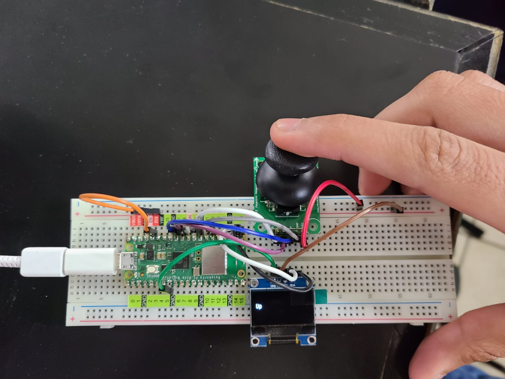
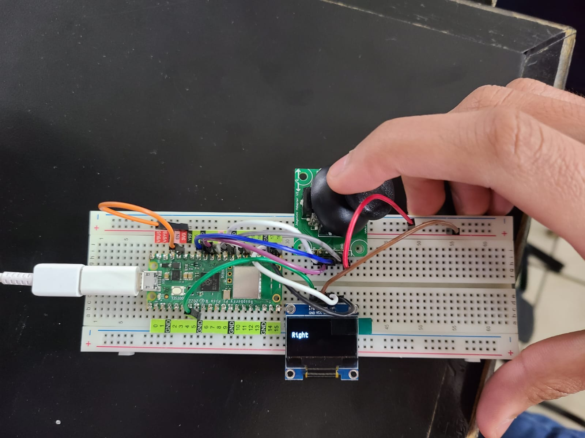

# KY-023 Joystick

## OBJETIVO:

Mostrar el boton que se esta presionando en el joystick usando Raspberry Pi Pico

## CÓDIGO
```python
from machine import Pin, ADC
import utime

xAxis = ADC(Pin(26))
yAxis = ADC(Pin(27))
button = Pin(17,Pin.IN, Pin.PULL_UP)

led_left = Pin(14, Pin.OUT)
led_middle = Pin(15, Pin.OUT)
led_right = Pin(12, Pin.OUT)
led_up = Pin(18, Pin.OUT)
led_down = Pin(13, Pin.OUT)

while True:
    xValue = xAxis.read_u16()
    yValue = yAxis.read_u16()
    buttonValue = button.value()
    xStatus = "middle"
    yStatus = "middle"
    buttonStatus = "not pressed"
    
    led_left.value(0)
    led_down.value(0)
    led_up.value(0)
    led_right.value(0)
    led_middle.value(1)
    
# Check the x and y Value to determine the status of the joystick
    if buttonValue == 0:
        buttonStatus = "pressed"
        led_middle.value(0)
        
    if xValue <= 600:
        xStatus = "right"
        led_left.value(1)
        led_middle.value(0)
        
    if xValue >= 60000:
        xStatus = "left"
        led_right.value(1)
        led_middle.value(0)
        
    if yValue <= 600:
        yStatus = "down"
        led_up.value(1)
        led_middle.value(0)
        
    if yValue >= 60000:
        yStatus = "up"
        led_down.value(1)
        led_middle.value(0)
        
   
    
    print("X: " + xStatus + "| Y: " + yStatus + " | button status: " + buttonStatus)
    utime.sleep(0.2)
```

## PRUEBAS






## CONCLUSIONES
Muy satisfecho con esta practica ya que aprendes a como controlar un joystick que es algo que la mayoria de nosotros llevamos usando desde que que somos niños y ahora poder programarlo es algo satisfactorio
